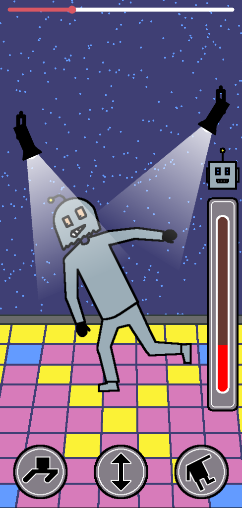
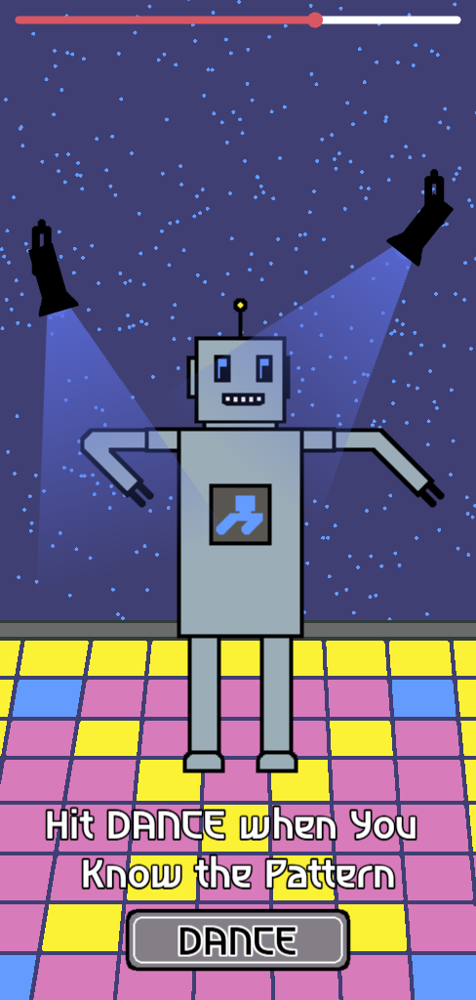
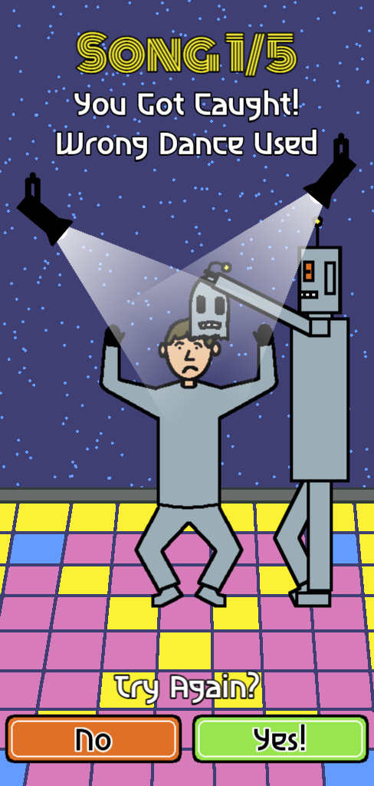

[](https://opensource.org/licenses/MIT)


This is my entry to [Gamedev.js Jam 2026](https://itch.io/jam/gamedevjs-2026) with the theme "Machines".

Play the game here: [MACHINE DISCO](https://stiggstogg.itch.io/machine-disco).

# About
The year is 2036. The machines rule the world. Every night, they party at the robot-only MACHINE DISCO. You are an old disco machine who desperately wants in. So tonight, you throw on a questionable robot disguise and sneak through the door...

More information on the game page!

# Build and Run Locally
This web game was created using **npm** and bundled with **vite.js**.
To build and run the project on your own machine, clone the repository, install the required dependencies, and start the development server.

```bash
git clone https://github.com/Stiggstogg/machines.git
cd machines
npm install
npm run dev
```

For a production build, use:

```bash
npm run build
```

The production-ready output will be available in the **dist** directory.
This project was created based on my **Phaser 4, Vite and TypeScript Template** available [here](https://github.com/Stiggstogg/phaser4-ts-vite-template). More information on further commands for development are available in the README file of this repository.

# Credits and Tools
Special thanks to my support and inspiration at home!
Thanks to my play testers

- **Code:** Home made typescript spaghetti code using [WebStorm](https://www.jetbrains.com/webstorm/) and bundled with [vite.js](https://vitejs.dev/)
- **Graphics**: Hand-drawn by me in [Aseprite](https://www.aseprite.org/)
- **Music**: [All by myself](https://www.youtube.com/watch?v=k2Y6kNVgaew) using [Reaper](https://www.reaper.fm/), a [Focusrite Scarlett 2i2](https://focusrite.com/products/scarlett-2i2) interface, a [PO-32 tonic](https://teenage.engineering/products/po-32) synthesizer, a [PO-14 sub](https://teenage.engineering/store/po-14/) synthesizer, an [ALESIS Q49](https://www.alesis.com/products/view/q49) midi keyboard, and the [TAL-Noisemaker](https://tal-software.com/products/tal-noisemaker) plugin (virtual synthesizer). Here is a [sneak peek](https://x.com/Stiggstogg/status/2047767936274727324?s=20) into my "studio".
- **Sound effects**: Created using [TAL-Noisemaker](https://tal-software.com/products/tal-noisemaker) and the [Speldosa](https://klevgrand.com/products/speldosa) plugin, played on an [ALESIS Q49](https://www.alesis.com/products/view/q49) midi keyboard and edited in [Reaper](https://www.reaper.fm/).
- **Framework**: [Phaser 4](https://phaser.io/)
- **Fonts**: [Monoton](https://fonts.google.com/specimen/Monoton) and [Asimovian](https://fonts.google.com/specimen/Asimovian) from Google Fonts

# Video and Screenshots:
Youtube: Comming soon (or never 😄)

  